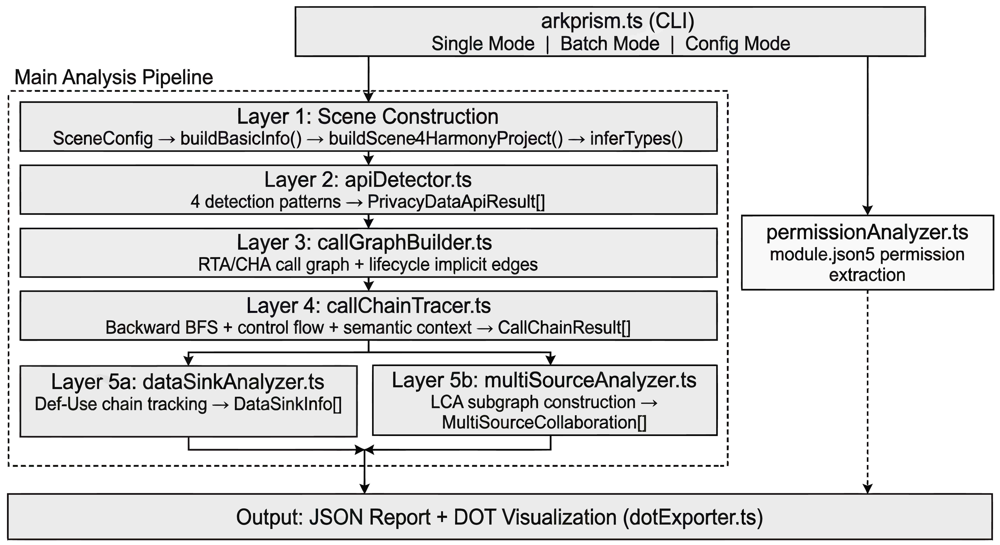

# ArkPrism

> **ArkTS Privacy-sensitive API Recognition and Information-flow Subgraph Mapping**

A static analysis tool for HarmonyOS app privacy compliance, built on [ArkAnalyzer](https://gitee.com/ArkAnalyzer/ArkAnalyzer). ArkPrism extracts privacy-sensitive control flow subgraphs — tracing data from entry methods through sensitive API calls to data sinks — and detects multi-source collaborative profiling behaviors.

## Features

- **Privacy API Detection**: Configurable rule-based detection covering 20+ privacy categories (device info, location, network, sensors, etc.)
- **Call Graph Construction**: RTA/CHA call graphs enhanced with lifecycle implicit edges and callback resolution
- **Call Chain Tracing**: Backward BFS from sensitive APIs to entry methods, extracting complete invocation paths
- **Control Flow Analysis**: Conditional branches (if/switch), loops, try-catch, with dominance tree precision
- **Data Sink Analysis**: Tracks where privacy data flows (network, storage, logs, UI display, return values)
- **Multi-Source Collaboration Detection**: Identifies combinations of non-permission APIs used for user profiling (e.g., device fingerprinting), constructing LCA-rooted subgraphs
- **HapFlow IFDS Taint Analysis** *(NEW)*: Inter-procedural taint analysis via IFDS framework with configurable source/sink rules — traces tainted data from privacy sources to data sinks across method boundaries, with optional pointer analysis for alias-aware precision
- **Semantic Context**: Extracts page names, component classes, semantic anchors, and purpose hints for downstream LLM analysis
- **Visualization**: JSON reports + Graphviz DOT call graphs

## Quick Start

### Prerequisites

- Node.js ≥ 16
- npm ≥ 8
- OpenHarmony SDK (required for HapFlow taint analysis, optional for basic analysis)

### Installation

```bash
git clone https://github.com/moanyilmaz/ArkPrism.git
cd ArkPrism
npm install
```

### Usage

```bash
# Analyze a single project
npx ts-node src/arkprism.ts <project-directory>

# Batch analyze all projects in a directory
npx ts-node src/arkprism.ts --batch <dataset-directory>

# Use a config file
npx ts-node src/arkprism.ts --config <config.json>

# Skip taint analysis (faster, pattern-matching only)
npx ts-node src/arkprism.ts --no-taint <project-directory>

# Skip pointer analysis (faster but less precise taint results)
npx ts-node src/arkprism.ts --no-pta <project-directory>

# Specify custom SDK path for API signature resolution
npx ts-node src/arkprism.ts --sdkPath /path/to/sdk <project-directory>
```

### Output

Results are written to `out/<project-name>/`:

| File | Description |
|------|-------------|
| `*-arkprism-report.json` | Full analysis report (API detections, call chains, multi-source collaborations, taint flows, permissions) |
| `*-privacy-graph.dot` | Graphviz DOT visualization of privacy call graphs |

## Analysis Pipeline



The analysis pipeline consists of the following layers:

1. **Scene Construction** — Build ArkAnalyzer Scene from project directory
2. **Privacy API Detection** — Pattern-match against configurable privacy API rules
3. **Call Graph Construction** — RTA/CHA call graphs with lifecycle and callback edges
4. **Call Chain Tracing** — Backward BFS from sensitive APIs to entry methods
5. **Data Sink Analysis** — Track where privacy data flows (network, storage, log, UI, return)
6. **Multi-Source Collaboration** — Detect collaborative profiling via LCA-rooted subgraphs
7. **HapFlow IFDS Taint Analysis** *(NEW)* — Inter-procedural taint propagation from source APIs to sink APIs

## Project Structure

```
ArkPrism/
├── src/
│   ├── arkprism.ts              # CLI entry point
│   ├── apiDetector.ts           # Layer 2: Privacy API detection
│   ├── callGraphBuilder.ts      # Layer 3: Call graph construction
│   ├── callChainTracer.ts       # Layer 4: Call chain tracing
│   ├── dataSinkAnalyzer.ts      # Layer 5a: Data sink analysis
│   ├── multiSourceAnalyzer.ts   # Layer 5b: Multi-source detection
│   ├── hapflowRunner.ts         # Layer 5.5: HapFlow taint analysis integration bridge
│   ├── hapflow/                 # HapFlow IFDS taint analysis framework
│   │   ├── TaintAnalysis.ts     #   IFDS taint problem definition (source/sink rules, flow functions)
│   │   ├── TaintAnalysisSolver.ts #   IFDS solver adapter
│   │   ├── TaintFact.ts         #   Taint fact representation (value + propagation path)
│   │   ├── DataflowSolver.ts    #   Generic IFDS dataflow solver
│   │   ├── LightTaintAnalysis.ts #   Lightweight taint analysis variant
│   │   ├── Source.ts            #   Source definition model
│   │   ├── Santization.ts       #   Sanitizer definitions
│   │   ├── MuiltiRef.ts         #   Multi-reference handling
│   │   └── Util.ts              #   SDK method resolution and helper utilities
│   ├── permissionAnalyzer.ts    # Permission declaration analysis
│   ├── dotExporter.ts           # DOT visualization exporter
│   ├── prototypes.ts            # Type definitions
│   ├── utils.ts                 # Utility functions
│   └── arkanalyzer/             # ArkAnalyzer library (bundled)
├── config/
│   ├── privacy_apis.json        # Privacy API rule definitions
│   ├── hapflow_sources.json     # HapFlow taint source definitions (privacy API signatures)
│   ├── hapflow_sinks.json       # HapFlow taint sink definitions (data exit points)
│   └── system_packages14.json   # HarmonyOS system package list
├── docs/
│   ├── implementation_details.md    # Technical implementation details (English)
│   └── implementation_details_zh.md # Technical implementation details (Chinese)
├── package.json
└── tsconfig.json
```

## Configuration

### Privacy API Rules (`config/privacy_apis.json`)

```json
{
  "packageName": "@ohos.deviceInfo",
  "methodName": "brand",
  "profilingCategory": "device_identity.hardware",
  "sensitivityLevel": "low"
}
```

### HapFlow Source/Sink Rules

**Sources** (`config/hapflow_sources.json`) — Define privacy-sensitive API methods that produce tainted data:
```json
{
  "module": "@ohos.telephony.sim",
  "api_name": "getSimState"
}
```

**Sinks** (`config/hapflow_sinks.json`) — Define data exit points where tainted data may leak:
```json
{
  "module": "@ohos.net.http",
  "api_name": "request"
}
```

### CLI Options

| Option | Description |
|--------|-------------|
| `--dot` / `--no-dot` | Enable/disable DOT visualization (default: enabled) |
| `--batch <dir>` | Batch analyze all projects in a directory |
| `--config <file>` | Use a JSON config file |
| `--no-taint` | Skip HapFlow IFDS taint analysis |
| `--no-pta` | Skip pointer analysis (faster but less precise) |
| `--sdkPath <dir>` | OpenHarmony SDK path for API signature resolution |

## HapFlow: IFDS Taint Analysis

**HapFlow** is an inter-procedural taint analysis engine integrated into ArkPrism, based on the IFDS (Interprocedural Finite Distributive Subset) framework. It complements ArkPrism's pattern-matching approach with dataflow-aware analysis.

### How It Works

1. **DummyMain Construction** — Creates a virtual entry method that aggregates all application entry points
2. **Pointer Analysis** (optional) — Resolves object aliases for context-sensitive call graph edges
3. **Source/Sink Loading** — Resolves privacy API method signatures against the OpenHarmony SDK
4. **IFDS Solving** — Propagates taint facts along inter-procedural control flow edges, tracking:
   - Return value tainting from source APIs
   - Parameter passing through method calls
   - Assignment propagation within methods
5. **Result Conversion** — Maps taint paths to ArkPrism's unified `TaintFlowResult` format

### Requirements

- **OpenHarmony SDK** is required for resolving API method signatures. Set via `--sdkPath`.
- Pointer analysis can be disabled with `--no-pta` for faster (but less precise) results.

## Tech Stack

- **ArkAnalyzer** — HarmonyOS static analysis framework (call graph, CFG, Def-Use chains, dominance tree)
- **TypeScript** — Type-safe analysis code
- **Node.js** — Runtime environment

## License

MIT
